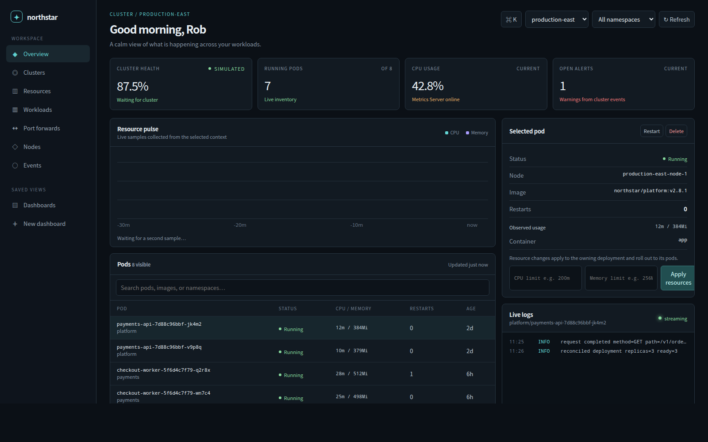
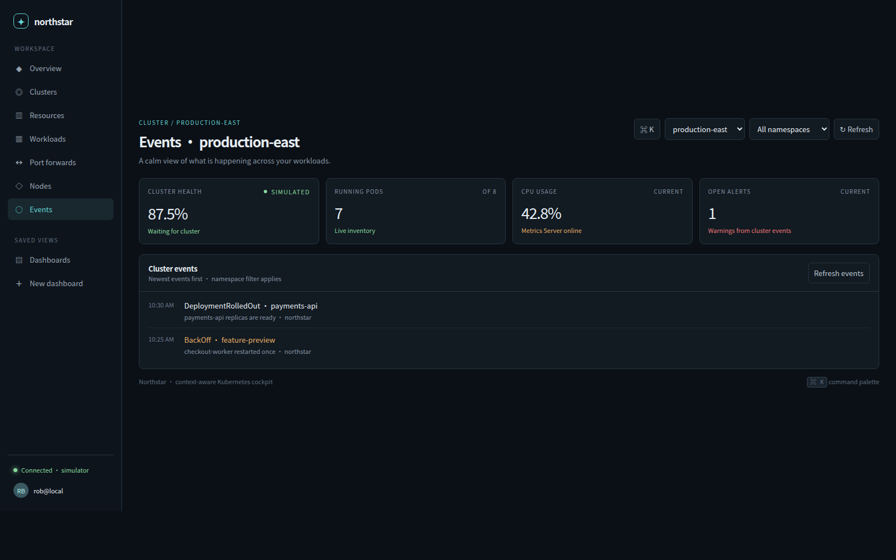
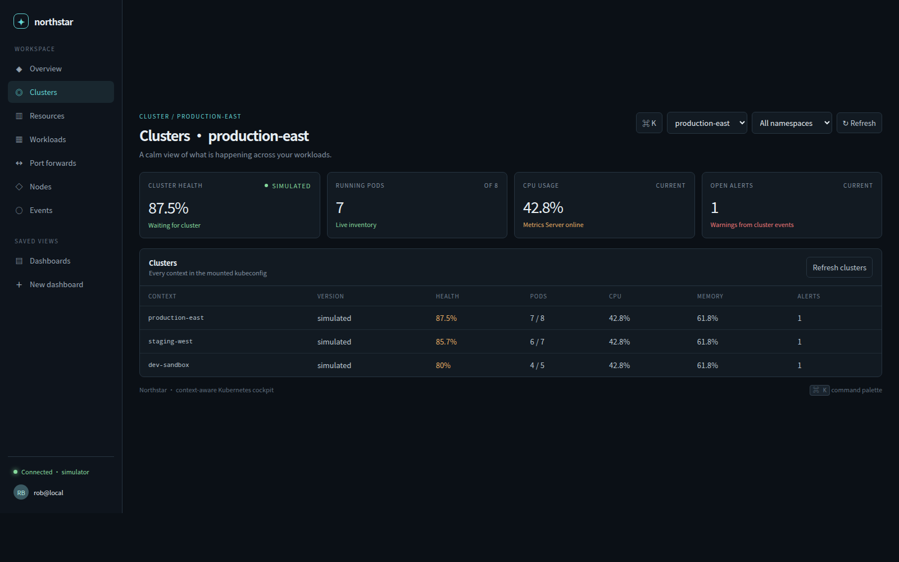

# Northstar

Northstar is a browser-based Kubernetes operations cockpit for contexts, namespaces, pods, workloads, nodes, events, logs, actions, Metrics Server, and Prometheus.

[](.github/workflows/ci.yml) [](https://github.com/RobBundy2002/northstar/actions/workflows/ci.yml) [](#interactive-demo)

[Live Demo](https://robbundy2002.github.io/northstar/) · [Documentation](docs/demo.md) · [Run Locally](#demo)

## Try Northstar

[Open the interactive demo](index.html) · [Run the full demo with Docker](docs/demo.md)

No Kubernetes cluster, kubeconfig, Node.js, or `kubectl` is required for the simulated environment.




Northstar gives operators a calm, context-aware view of live and simulated Kubernetes environments. Browse the [incident timeline](docs/screenshots/incident-timeline.png) and [multi-cluster dashboard](docs/screenshots/multi-cluster.png) screenshots, or launch the demo locally in one command.

## Why Northstar?

Managing Kubernetes through `kubectl` is powerful, but investigating incidents often means jumping between commands, logs, events, metrics, and manifests. Northstar brings those workflows together in one context-aware cockpit, while keeping authorization and safety checks on the server side.

## Demo

No cluster or kubeconfig is required:

```bash
docker compose up --build
```

Then open `http://localhost:5173`. The full demo setup, sample cluster, and teardown instructions live in [docs/demo.md](docs/demo.md).





## Project guide

- [Architecture](docs/architecture.md)
- [Security model and threat mitigations](docs/security.md)
- [RBAC examples](docs/rbac.md)
- [Contributing](CONTRIBUTING.md)
- [Roadmap](ROADMAP.md)
- [Changelog](CHANGELOG.md)

Run `npm run check` for linting and automated API tests. GitHub Actions runs validation, container builds, and Trivy security scanning on every push and pull request; version tags (`v1.2.3`) publish a GitHub release and GHCR image.

## What Northstar Provides

- Command palette with `Cmd+K` / `Ctrl+K`
- First-run diagnostics for kubeconfig, contexts, RBAC, Metrics Server, and Prometheus
- RBAC-aware actions that disable controls the mounted kubeconfig cannot perform
- Multi-cluster summary across every kube context
- Pod, workload, node, event, and alert views
- Workload detail with pods, services, events, and multi-pod logs
- Generic resource explorer for built-in Kubernetes resources and CRDs
- YAML and describe inspector for live resources
- Live pod logs, multi-pod log tailing, filters, and guarded pod exec
- Managed local port-forwards
- Incident timeline combining events and audited actions
- Metrics Server and Prometheus integration
- Shareable URL hashes for context, namespace, and current view
- Production guardrails and audit logging for cluster-changing actions
- Read-only mode for safe real-cluster handoffs

## Connect to an existing cluster

Requirements: Node.js 18+, `kubectl`, and a kubeconfig that can already access the cluster.

```bash
cp .env.example .env
export NORTHSTAR_MODE=kubernetes
export NORTHSTAR_KUBECTL=kubectl
export NORTHSTAR_KUBECONFIG="$HOME/.kube/config"
export NORTHSTAR_CONTEXT=my-context
npm start
```

Open `http://localhost:5173`. Northstar discovers every context in the kubeconfig and lets the operator switch between them. Actions require RBAC permissions for the selected resources.

For a first run against a real cluster, keep cluster actions disabled:

```bash
export NORTHSTAR_READ_ONLY=true
```

Read-only mode still shows contexts, namespaces, pods, workloads, nodes, events, logs, Metrics Server values, and Prometheus queries. It blocks rollout restart, scale, resource changes, delete, and pod exec at the API layer.

Read-only mode also blocks managed port-forward start/stop operations. Existing resource discovery, YAML, describe, logs, events, metrics, and Prometheus query views remain available.

Northstar also checks the current kubeconfig with `kubectl auth can-i` and disables UI controls that are not permitted by RBAC. The backend enforces read-only mode regardless of UI state.

Enable actions only after using a scoped kubeconfig or ServiceAccount:

```bash
export NORTHSTAR_READ_ONLY=false
```

For Prometheus-backed queries, also set:

```bash
export NORTHSTAR_PROMETHEUS_URL=http://prometheus.monitoring.svc:9090
npm start
```

## Docker Compose

Build and run Northstar with a kubeconfig mounted read-only. Compose binds the UI and bundled Prometheus to localhost by default.

```bash
cp .env.example .env
# edit .env and set NORTHSTAR_CONTEXT plus NORTHSTAR_KUBECONFIG_PATH
docker compose -f docker-compose.kubernetes.yml up --build
```

Open `http://localhost:5173`.

Both Northstar dashboard data and Prometheus time-series data are stored in named Docker volumes, so they survive container restarts and image rebuilds. The `northstar` service is intentionally bound to `127.0.0.1`; put it behind an authenticated HTTPS reverse proxy such as Caddy or Nginx when hosting it on a server.

For a persistent server deployment:

```bash
docker compose -f docker-compose.kubernetes.yml up -d --build
docker compose -f docker-compose.kubernetes.yml ps
docker compose -f docker-compose.kubernetes.yml logs -f northstar
```

Docker's `restart: unless-stopped` policy starts both services again after a host reboot. Back up the volumes periodically:

```bash
docker run --rm -v untitled1_northstar-data:/data -v "$PWD":/backup alpine \
  tar czf /backup/northstar-data-backup.tgz -C /data .
```

The Compose setup starts Northstar and Prometheus. It is intended for localhost or a private network; do not expose the operator endpoint publicly without authentication and a restricted RBAC profile.

If the target cluster already has Prometheus, set `NORTHSTAR_COMPOSE_PROMETHEUS_URL` in `.env`. Otherwise the bundled Prometheus scrapes Northstar's `/metrics` endpoint.

## Real Cluster Handoff

The safest handoff flow for another operator is:

```bash
git clone <repo-url>
cd northstar
cp .env.example .env
```

Edit `.env`:

```bash
NORTHSTAR_CONTEXT=my-real-context
NORTHSTAR_KUBECONFIG_PATH=/Users/me/.kube/config
NORTHSTAR_READ_ONLY=true
```

Then run:

```bash
docker compose -f docker-compose.kubernetes.yml up --build
```

To validate the kubeconfig before starting Northstar:

```bash
kubectl --context my-real-context get namespaces
kubectl --context my-real-context top nodes
```

`kubectl top` requires Metrics Server in the target cluster. Northstar still works without it, but CPU and memory cards show `N/A`.

If local kind or minikube clusters publish their API servers on `127.0.0.1`, containers need the Docker host gateway instead. Set `NORTHSTAR_KUBECONFIG_SERVER_HOST=host.docker.internal` in `.env`; Northstar will create a temporary rewritten kubeconfig inside the container while preserving the original kubeconfig read-only.

If those local clusters listen only on host loopback, use the host-network override instead:

```bash
docker-compose -f docker-compose.kind.yml up -d --build
```

This override is for local kind/minikube only. Use the regular Compose file for a VPS or remote Kubernetes APIs.

## RBAC Profiles

For a cluster-managed ServiceAccount, start with read-only access:

```bash
kubectl create namespace northstar --dry-run=client -o yaml | kubectl apply -f -
kubectl apply -f k8s/northstar-readonly-rbac.yaml
```

Operator access is intentionally separate:

```bash
kubectl apply -f k8s/northstar-operator-rbac.yaml
```

Only use operator access with `NORTHSTAR_READ_ONLY=false`.

## Operator Guardrails

When operator mode is enabled, Northstar writes recent action attempts to `data/audit.jsonl`.

Actions against contexts with `prod` or `production` in the name require confirmation. Scale-to-zero also requires confirmation. These guardrails apply to the API, not only the browser UI.

## Helm

The recommended Kubernetes-native deployment runs Northstar in the cluster with its own ServiceAccount and read-only ClusterRole. No kubeconfig Secret is required; the Kubernetes client uses the pod's in-cluster ServiceAccount credentials.

```bash
docker build -t registry.example.com/northstar:latest .
docker push registry.example.com/northstar:latest
helm upgrade --install northstar ./helm/northstar \
  --namespace northstar --create-namespace \
  --set image.repository=registry.example.com/northstar \
  --set image.tag=latest \
  --set readOnly=true \
  --set rbac.mode=readonly
```

The chart creates and binds the ServiceAccount automatically. In in-cluster mode, `context` is only the Northstar display name; Kubernetes API access comes from the pod identity. Set `--set context=my-cluster` if you want a custom display name.

The Helm deployment creates a PersistentVolumeClaim for dashboard data by default. Configure `persistence.size` and `persistence.storageClass` for the storage class in your cluster.

To allow operator actions through Helm, make both settings explicit:

```bash
helm upgrade --install northstar ./helm/northstar \
  --namespace northstar --create-namespace \
  --set image.repository=registry.example.com/northstar \
  --set image.tag=latest \
  --set context=my-context \
  --set readOnly=false \
  --set rbac.mode=operator
```

The chart creates a ServiceAccount, ClusterRole, ClusterRoleBinding, Deployment, and Service. The default role is read-only. Review the operator role before using it in production.

For an external-cluster deployment where Northstar runs outside the target cluster, use the [Docker Compose kubeconfig setup](#docker-compose) instead. Helm also supports an explicitly supplied Secret through `kubeconfigSecret`, but that is an advanced compatibility option rather than the default deployment model.

## Local demo

The local Docker-backed demo remains available:

```bash
npm run start:all
```

If port 5173 or 9090 is already occupied, Northstar automatically selects the next available port and updates its Prometheus scrape target.
## Interactive demo

The root `index.html` provides an interactive demo for GitHub Pages. It detects that no Northstar API is available and supplies simulated clusters, pods, workloads, events, logs, resources, and dashboards in the browser.

To publish it:

1. Push the repository to GitHub on the `main-1` branch.
2. In **Settings → Pages**, set the source to **GitHub Actions**.
3. Push to `main` or run **Deploy Northstar demo to GitHub Pages** from the Actions tab.

When run locally with `npm start`, the page continues to use the real Node API in `server.js`.
