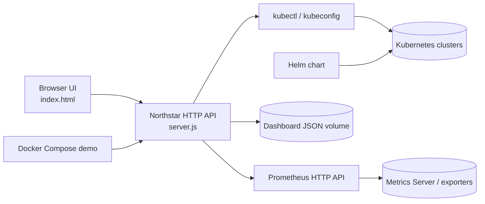

# Architecture

Northstar keeps the browser thin: the server owns kubeconfig access, resource validation, read-only enforcement, log streams, port-forward lifecycle, and Prometheus queries. The simulated mode uses the same API contract as Kubernetes mode, which is why the demo can run without a cluster.

## Deployment boundaries

- Local demo: `docker-compose.yml`, simulated data, no kubeconfig required.
- Real-cluster handoff: `docker-compose.kubernetes.yml`, kubeconfig mounted read-only.
- In-cluster deployment: `helm/northstar`, with a ServiceAccount and selectable RBAC profile.
